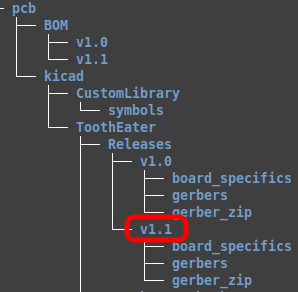

# ToothEater-HW-THT

This repository contains the hardware design of the Honda Blackbird v1.1 Tooth Eater Module - (Through hole version). This through hole version is intended for the DIY'er for easier construction. This PCB is a simple 2 layer design, measuring 44mm x 44mm for insertion into the Hammond 1551R case.  
This hardware is designed to work with the latest firmware version (v1.x) contained in the firmware respository. I.e. <i>'ToothEater_v1.2.hex'.</i> 
 
Shown below are blank boards as received by PCBWay. This is a small unit slightly larger than a matchbox, shown in the 2" x 2" case.

<table border="1">
<tr>

<td align="center" valign="center">

</img>
</td>

<td>

</img>
</td>

</tr>
</table>

 

A zoomed picture of the board is shown below. The full bill of materials can be found in the 'BOM' directory, however the table below will quickly identify the components. This table reflects the BOM for PCB v1.1.

<table border="3">
<tr>
<td align="center" valign="center"><b><u>Component</u></b></td>
<td align="center" valign="center"><b><u>Value</u></b></td>
</tr>

<tr>
<td align="center" valign="center">U1</td>
<td align="center" valign="center">atTiny85 microcontroller</td>
</tr>

<tr>
<td align="center" valign="center">U2</td>
<td align="center" valign="center">VR conditioner plug-in module (speeduino compatible)</td>
</tr>

<tr>
<td align="center" valign="center">U3</td>
<td align="center" valign="center">MCP100 reset chip</td>
</tr>

<tr>
<td align="center" valign="center">Q1</td>
<td align="center" valign="center">BD681</td>
</tr>

<tr>
<td align="center" valign="center">D1</td>
<td align="center" valign="center">1N4004</td>
</tr>

<tr>
<td align="center" valign="center">D2</td>
<td align="center" valign="center">6.2v zener</td>
</tr>

<tr>
<td align="center" valign="center">C1, C2</td>
<td align="center" valign="center">100n</td>
</tr>

<tr>
<td align="center" valign="center">R1</td>
<td align="center" valign="center">1K5</td>
</tr>

<tr>
<td align="center" valign="center">R2</td>
<td align="center" valign="center">470</td>
</tr>

<tr>
<td align="center" valign="center">R3,R5</td>
<td align="center" valign="center">10K</td>
</tr>

<tr>
<td align="center" valign="center">R4,R6</td>
<td align="center" valign="center">1K</td>
</tr>

<tr>
<td align="center" valign="center">R7,R9</td>
<td align="center" valign="center">47K</td>
</tr>

<tr>
<td align="center" valign="center">R11</td>
<td align="center" valign="center">4K7</td>
</tr>

<tr>
<td align="center" valign="center">R8,R10,R12</td>
<td align="center" valign="center">330</td>
</tr>

<tr>
<td align="center" valign="center">Q2,Q3,Q4,Q5,Q6</td>
<td align="center" valign="center">BC546B</td>
</tr>

<tr>
<td align="center" valign="center">D3</td>
<td align="center" valign="center">Power Led - Red (standard 3mm spacing)</td>
</tr>

<tr>
<td align="center" valign="center">D4,D5</td>
<td align="center" valign="center">Crank and cam Leds - Yellow (standard 3mm spacing)</td>
</tr>

<tr>
<td align="center" valign="center">J1,J2</td>
<td align="center" valign="center">Molex Micro-Fit 3.0 43045 </td>
</tr>

</table>

</img>

  
The board is shown below with the components assembled.

</img>

 

<table border="1">

The following illustrates different views of the v1.1 assembled board (without the VR mini-board installed). 

<tr>
<td align="center" valign="center">

</img>
</td>
<td>

</img>
</td>
</tr>

<tr>
<td align="center" valign="center">

</img>
</td>
<td>

</img>
</td>
</tr>

</table>

<table border="1">
<tr>

  
The board is shown below with two mini wiring harnesses connected to it, along with the speeduino compatible VR plug in mini board.

<td align="center" valign="center">

</img>
</td>

</tr>
</table>

  
Once the VR board is inserted into the tooth eater module, it may sit to tall such that it will not allow the lid to close on the case. This is due to the height of the two female 4x1 headers (8.5mm height) that is sits within. To remedy this, the plastic stand-offs may be pryed off with a screwdriver or similar. This will allow the VR module to sink lower into the tooth eater board once it is inserted.

</img>

 
Afterwards it will sit as follows. The overall height will now allow the package to fit within the case.

</img>

  
When assembled, the BD681 transistor sits slightly proud of the case top (~2mm). This can be fixed by bending it to the left as shown.

</img>

</img>

  
The connectors require a section to be cut out of the case.

</img>

</img>

  
The board is fitted to the case and relative size is shown.

</img>

</img>

  

<table border="3">
<tr>
<td>

The final connections are shown as follows:

</td>
</tr>

<tr>
<td>

</img>
</td>
</tr>

<tr>
<td>

The board requires +12v and a ground connection. These can be tapped off the wires that feed your ECU.

</td>
</tr>

<tr>
<td>
The inputs to this module are:
<ul>
  <li> CRANK VR+ (from the bikes wiring harness) </li>
  <li> CAM VR+ (from the bikes wiring harness) </li>
  <li> VR- (shared with both crank & cam VR- on the bikes wiring harness) </li>
</ul>
</td>
</tr>

<tr>
<td>
The outputs are:
<ul>
  <li>CAM TTL (0-4.1v level single cam pulse - fed into your downstream ECU)</li>
  <li>CRANK TTL (0-4.1v level single crank pulse - fed into your downstream ECU)</li>
  <li>TACHO (0-12v level square wave - fed to your dash via pin A19 on main wiring harness)</li>
</ul>
</td>
</tr>

<tr>
<td>

Notes: 
1. The crank signal is the 12 pulses per crank rotation. The cam signal is post-processed by the tooth eater, therefore 1 cam pulse per engine cycle (I.e. Two crank revolutions, 720 deg).  
2. The TTL output voltages are square wave outputs. The output voltage is slightly less than 5.0v and realistically closer to 4.1v. This should be fine in practice for ECUs expecting either 5.0v or 3.3v inputs (with internal built in protection on its inputs). In the future on the next board revision, I may add a jumper and a voltage divider to offer both use cases. 

</td>
</tr>

</table>

 

## Additional notes to observe

1. If you are using the speeduino compatible VR conditioner mini board by 'OpenLogic EFI', then you will need to solder both VR1 and VR2 jumpers as shown in the image below. This is so your crank and cam signals can be processed by the tooth eater.
2. There are also additional jumpers on the underside of the board. If you are using the VR board as mentioned above then leave these open circuit (o.c) as they are. These jumpers are of no practial use on the bike.  
The purpose of these jumpers are mainly for bench testing the board with 0-5v TTL signals when testing with ardu-stim, so they should only be soldered when bench testing or when HALL effect sensors are being used instead of the VR.
<table border="1">
<tr>

<td align="center" valign="center">

</img>
</td>

<td>

</img>
</td>

</tr>
</table>

  

# Hardware Design

<table border="1">

<tr> 
<td width="20%">
<strong><u>Current Revision</u></strong>
</td>
<td width="60%">
<strong><u>Date</u></strong>
</td>
<td width="20%">
<strong><u>Author</u></strong>
</td>
</tr>

<tr>
<td width="20%">
v1.1
</td>
<td width="60%">
July 2026
</td>
<td width="20%">
Alex Kiaos
</td>
</tr>

</table>

 
This project has been designed in Kicad 6.0.11 under linux and is licenced under the CERN Open Hardware Licence Version 2 - Strongly Reciprocal (CERN-OHL-S).  

The directory structure of this project is as follows:

<table border="1">

<tr> 
<td width="20%">
<strong><u>Directory</u></strong>
</td>
<td width="80%">
<strong><u>Description</u></strong>
</td>
</tr>

<tr>
<td width="20%">
BOM
</td>
<td width="80%">
Bill of materials
</td>
</tr>

<tr>
<td width="20%">
kicad
</td>
<td width="80%">
The main project file is 'ToothEater.kicad_pro' found under '/pcb/kicad/ToothEater'.  
Gerber files can be found as a group of 9 individual files under the 'gerbers' directory or as a single zipped file under the 'gerber_zipped' directory for uploading to a PCB house for manufacture.  
The 'CustomLibrary' directory contains the custom symbols and footprints used in the project.
</td>
</tr>

</table>

 
After cloning the repository and opening the project for the first time, you may need to set up the symbol library path. 

To setup the symbols library, in the menu: 
<pre><i>Preferences -> Manage Symbol Libraries</i> 
  Then in the 2nd tab under 'Project specific libraries' add the following: 
Nickname: <b>ToothEater</b> 
Library Path: <b>${KIPRJMOD}/../CustomLibrary/symbols/ToothEater_symbols.kicad_sym</b> 
</pre>
  

# Relevant links

### PCBWay
To visit the PCBWay project and/or place an [order](https://www.pcbway.com/project/shareproject/Honda_CBR_Tooth_Eater_Module_Compatibility_module_for_the_CBR_1100XX_Super_Bla_bf3a4c0d.html).

### Wiring Harness & Pinouts
To see the ECU pin-out details, refer to the latest pdf file at: 
[Wiring Harness Pinout diagram](https://github.com/BlackbirdStandalone/Documentation/tree/main/wiring).

